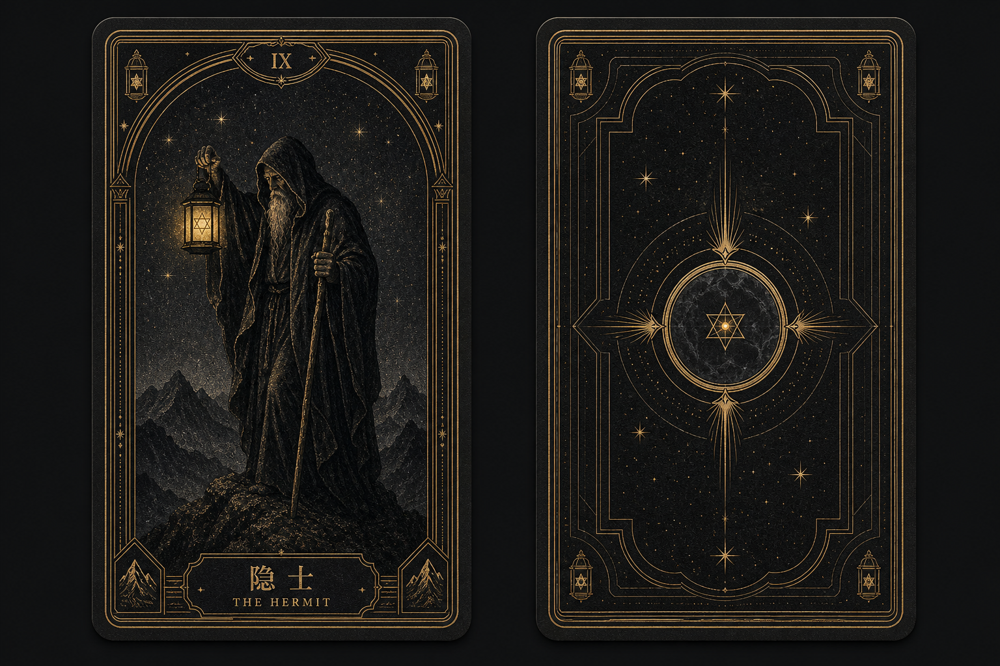

# 心镜拾光

> 翻开牌面，照见自己。

心镜拾光是一款以图像卡片为交互媒介的微信小程序，通过短仪式、CloudBase AI 个性化解读和可选的本地历史，帮助用户整理困扰、获得新的观察角度并形成一个可执行的小行动。

它是一项非商业化个人作品集项目，不对未来作确定性断言，也不替代心理、医疗、法律或金融专业意见。

## 当前状态

- 阶段：v1.1 完整牌组候选；CloudBase AI 与 `hy3` 已接入，78 张牌组工程门禁已通过，仍需发布前人工门禁
- 工程：微信原生小程序 TypeScript + 本地 Repository + CloudBase AI Provider + 小程序码云函数；无需在小程序包内配置模型密钥或 AppSecret
- MVP：每日一牌、主题单牌与“现状—关键影响—行动建议”三牌模式、安全阻断与降级、可选本地历史
- 解读：模型直接根据用户问题识别重点；总览、逐牌切换、可展开牌义、综合提示、反思与行动按接收顺序渐进呈现
- 图鉴：78 张完整牌组按大阿尔卡那、权杖、圣杯、宝剑、星币分组，按实际翻牌解锁并记录正逆位与翻开次数
- 视觉：A“仪式典藏”22 张大阿尔卡那、56 张小阿尔卡那与统一卡背已经接入；Logo 已选定 L5“繁饰日蚀心镜”
- 包体：仪式、结果、历史、图鉴和完整牌面置于 `deck` 普通分包；主包保留 78 张轻量缩略图，主包和分包均低于 2 MiB
- 鉴赏：翻牌后、结果页和图鉴详情均可进入沉浸大图；统一成牌组件为小阿尔卡那补齐旧金边框、顶部牌阶与中英文铭牌，并保留正逆位、牌位与卡牌名称信息
- 分享：首页可生成介绍小程序的通用分享图；结果页可生成包含牌面、受控摘要、微行动的黑金竖版分享图；两者均嵌入可长按识别的小程序码，结果图不展示用户原问题
- 历史：每日牌与主题解读自动保留最近 30 条，仅存当前设备，可单条删除

## 卡牌视觉



全套 78 张卡牌使用 A“仪式典藏”：黑灰手工版画、纤维纸与不均匀旧金。22 张大阿尔卡那与 56 张小阿尔卡那均已完成生成、逐牌语义和整套一致性验收；正式源图确定性生成分包展示图与主包缩略图，接入抽牌、结果、鉴赏大图和分组图鉴，逆位由前端旋转同一资产。

生成合同分别见 [大阿尔卡那生成包](deliverables/style-a-deck-generation-kit/README.md) 与 [小阿尔卡那生成包](deliverables/style-a-minor-arcana-generation-kit/README.md)，最终验收见 [56 张生成报告](assets/tarot-card-style/minor-arcana/generation-report.md)。

## 文档

1. [产品材料索引](docs/product/README.md)
2. [产品定义与调研结论](docs/product/01-product-brief.md)
3. [MVP PRD](docs/product/02-mvp-prd.md)
4. [技术架构方案](docs/product/03-technical-architecture.md)
5. [开发路线与作品集计划](docs/product/04-development-roadmap.md)
6. [Claude Opus 4.8 架构审查](docs/product/05-claude-architecture-review.md)
7. [PRD 自检报告](docs/product/06-prd-review.md)
8. [长程开发执行基线](docs/product/07-execution-baseline.md)
9. [v0.2 三牌与图鉴扩展 PRD](docs/product/08-v0.2-three-card-and-collection.md)
10. [v0.3 高保真体验与解读减负](docs/product/09-v0.3-high-fidelity-experience.md)
11. [v1.1 完整 78 张牌组](docs/product/10-v1.1-complete-78-card-deck.md)
12. [分享图增量](docs/product/11-share-poster.md)
13. [卡片风格基准](assets/tarot-card-style/README.md)
14. [A 风格大阿尔卡那生成交接包](deliverables/style-a-deck-generation-kit/README.md)
15. [A 风格小阿尔卡那生成交接包](deliverables/style-a-minor-arcana-generation-kit/README.md)

## 仓库结构

```text
apps/miniprogram/  # 微信原生小程序与本地适配器
cloudfunctions/     # CloudBase 单一 api 云函数；当前用于生成小程序码
assets/            # 卡片、品牌与界面视觉资产
docs/              # 产品、架构、评审和验收资料
tests/             # 领域、安全、CloudBase Provider 与解读契约测试
workspace/         # 临时工作文件，不进入版本库
```

## 本地运行

```powershell
npm install
npm run typecheck
npm test
npm run validate:assets
```

随后在微信开发者工具中导入仓库根目录。工程已配置正式小程序 AppID，并在 `apps/miniprogram/config/cloud.ts` 中固定 CloudBase 环境 `<your-cloudbase-env-id>`、AI Provider `cloudbase` 和模型 `hy3`。基础库需不低于 3.15.1；当前工程使用 3.17.0。

`cloudfunctions/api` 已部署到同一 CloudBase 环境，开发版首页分享图已成功生成。体验版/正式版的长按识别与跨设备扫码仍按 [分享图云函数部署与验收](docs/development/share-poster.md) 完成发布前复验。

每日一牌仍使用本地受控牌义。主题问题会连同牌阵、卡牌事实和受控牌义发送至 CloudBase AI，由 `hy3` 直接根据问题识别重点并生成结构化建议；用户不再需要预选感情、人际、事业或自我类别。输出必须通过字段、牌面事实、问题焦点和安全校验，摘要不得机械复述原问题，否则自动降级为本地基础牌义。问题和历史不进入仓库，历史只保存在当前设备且不跨设备同步；CloudBase 控制台可能保留 AI 调用记录，用户不应输入姓名、电话、住址等可识别信息。

发布前验收与剩余门禁见 [v1.0 AI 接入与发布检查](docs/development/v1.0-ai-integration.md)。

本仓库自 2026-07-19 起作为心镜拾光项目的唯一维护源。原 ProductManager 仓库只保留迁移前快照与位置说明。
