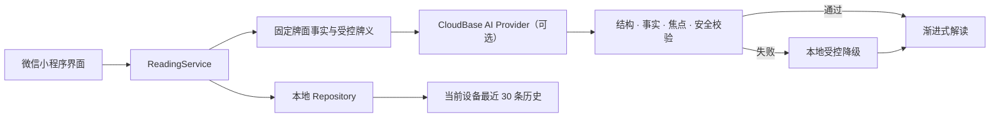

<p align="center">
  
</p>

<h1 align="center">心镜拾光</h1>

<p align="center">
  翻开牌面，照见自己。<br />
  一款以图像卡片、渐进式阅读与受控 AI 解读为核心的微信小程序。
</p>

<p align="center">
  <a href="https://github.com/chenzhiyong1994/arcana-mirror/actions/workflows/ci.yml"></a>
  
  
  
  
</p>

心镜拾光不是“预测答案”的工具。它把随机出现的图像卡片当作一种反思媒介：先让用户观察自己的第一反应，再用受控牌义、具体问题与可执行的小行动，把模糊感受整理成更容易理解的线索。

项目完整实现了从产品定义、78 张原创牌组、微信小程序交互，到 CloudBase AI 接入、安全校验、失败降级和资产门禁的一条端到端链路。它既是一款可运行的作品，也是一份关于“小型 AI 产品怎样守住边界”的工程样本。

> 内容仅供娱乐和自我反思，不构成心理、医疗、法律、金融或其他专业建议，也不对未来作确定性断言。

## 它有什么不同

| 设计重点 | 实现方式 |
| --- | --- |
| 不急着给答案 | 抽牌前保留短仪式，先看图像与直觉，再逐层展开文字 |
| 不制造“AI 神谕” | 模型只能基于已抽卡牌事实、牌位和受控牌义组织建议 |
| 不堆成文字墙 | 三牌一次只读一张；牌义依据默认折叠；生活方向用页签切换 |
| 不让失败破坏流程 | 超时、非法 JSON、事实错配或安全校验失败时回退到本地受控内容 |
| 不把隐私变成产品燃料 | 历史只保存在当前设备；不读取旧问题；分享图不展示用户原问题 |
| 不把 78 张图当散装素材 | 牌义合同、视觉合同、共享框、分包、缩略图和逐牌验收形成完整资产流水线 |

## 一次完整体验

<p align="center">
  
  &nbsp;
  
  &nbsp;
  
</p>

1. 选择每日一牌、单牌或三牌，并决定使用无问题的生活指引还是一个具体问题。
2. 依次翻开卡片；正逆位、顺序与牌位一经生成便不再改变。
3. 先读“第一眼线索”，再按牌切换情境解释、方向洞察与可选牌义依据。
4. 最后收束到一个反思问题和一个 24 小时内可完成的微行动。

页面截图来自微信开发者工具的真实渲染，不是概念 UI；截图使用合成测试内容，不含真实用户数据。

## 78 张“仪式典藏”牌组

<p align="center">
  
</p>

全套牌组采用煤黑、石墨灰、纤维纸与不均匀旧金的统一视觉语言。22 张大阿尔卡那与 56 张小阿尔卡那均从“牌义层”开始定义，再进入视觉生成和工程验收；标题、编号、共享正面框与正逆位表现由前端确定性完成。

- [牌组视觉与资产索引](assets/tarot-card-style/README.md)
- [大阿尔卡那生成交接包](deliverables/style-a-deck-generation-kit/README.md)
- [小阿尔卡那生成交接包](deliverables/style-a-minor-arcana-generation-kit/README.md)
- [56 张小阿尔卡那验收报告](assets/tarot-card-style/minor-arcana/generation-report.md)

## 系统怎样工作



核心实现有几条刻意保持简单的不变量：

- 抽牌事实先生成并固定，AI 不能更换卡牌、牌位、顺序或朝向。
- 具体问题只作为待分析数据进入结构化边界，不能覆盖 System Prompt。
- 输出必须匹配卡名、朝向、位置、受控牌义与当前模式；不合格内容不会直接展示。
- 每日一牌完全使用本地内容；未配置 CloudBase 时，单牌与三牌也能安全降级。
- 小程序包内不保存模型密钥、微信 AppSecret 或控制台凭据。

更完整的契约见 [技术架构](docs/product/03-technical-architecture.md) 与 [CloudBase AI 接入及发布检查](docs/development/v1.0-ai-integration.md)。

## 快速开始

### 环境要求

- Node.js 20+
- npm 10+
- 微信开发者工具

### 安装与验证

```powershell
git clone https://github.com/chenzhiyong1994/arcana-mirror.git
cd arcana-mirror
npm install
npm run typecheck
npm test
npm run validate:assets
```

`npm install` 会根据以下模板创建两个被 Git 忽略的本地文件，并且不会覆盖已经存在的配置：

- `project.config.example.json` → `project.config.json`
- `apps/miniprogram/config/cloud.example.ts` → `apps/miniprogram/config/cloud.ts`

随后在微信开发者工具中导入仓库根目录。开源模板默认使用 `touristappid`，足以浏览本地界面和受控降级路径。

### 启用自己的 CloudBase AI

1. 在微信开发者工具中填写自己的小程序 AppID，并创建或选择自己的 CloudBase 环境。
2. 只在本地 `apps/miniprogram/config/cloud.ts` 中填写环境 ID；该文件已被 `.gitignore` 排除。
3. 在自己的环境中启用 CloudBase 内置 AI，确认 Provider 与模型配置可用。
4. 如需分享图中的小程序码，将 `cloudfunctions/api` 部署到同一环境。

不同账号可用的模型、套餐与审核条件可能不同。不要复制维护者的环境标识，也不要把 AppSecret、模型密钥或控制台凭据写入任何前端文件。

## 常用命令

| 命令 | 用途 |
| --- | --- |
| `npm run setup` | 补齐缺失的本地配置，不覆盖现有文件 |
| `npm run typecheck` | TypeScript 类型检查 |
| `npm test` | 运行领域、安全与 Provider 契约测试 |
| `npm run validate:assets` | 校验 78 张牌、映射、尺寸与分包资产 |
| `npm run build:shared-card-assets` | 重新生成共享卡牌运行时资产 |
| `npm run build:minor-contact-sheets` | 重新生成小阿尔卡那花色联排 |

## 仓库结构

```text
apps/miniprogram/   微信原生小程序、领域服务与本地适配器
cloudfunctions/     仅生成小程序码的 CloudBase 云函数
assets/             品牌、卡牌源图、运行时图与 README 视觉素材
deliverables/       大/小阿尔卡那生成合同与交接包
docs/               产品、架构、路线、发布检查和验收记录
tests/              领域、安全、AI Provider 与解读契约测试
tools/              资产构建、配置初始化与一致性校验脚本
```

## 项目状态

当前为 **v1.1 完整牌组候选版**：核心代码、78 张牌组、资源门禁与 CloudBase AI 调用链已经完成；正式上线仍需完成真机、真实 AI 样本、用量告警、隐私指引与微信审核等人工门禁。因此仓库不会把“本地测试通过”描述成“已经具备生产质量保证”。

产品范围与演进材料从 [产品文档索引](docs/product/README.md) 开始。想快速理解设计取舍，可以先读：

- [产品定义与调研结论](docs/product/01-product-brief.md)
- [MVP PRD](docs/product/02-mvp-prd.md)
- [v0.3 高保真体验与解读减负](docs/product/09-v0.3-high-fidelity-experience.md)
- [v1.1 完整 78 张牌组](docs/product/10-v1.1-complete-78-card-deck.md)

## 参与贡献

Bug 复现、可访问性改进、微信机型兼容、测试补充与小型文档修正都很欢迎。开始前请阅读 [贡献指南](CONTRIBUTING.md)；安全问题请不要公开披露，改用 [安全策略](SECURITY.md) 中的私密渠道。

这个项目有意保持“克制”：社区、付费、真人服务、更多复杂牌阵或确定性预测不在当前范围内。提出功能建议时，请说明它怎样帮助用户更清楚地观察自己，而不是怎样让结果显得更神秘。

## 许可

- `apps/`、`cloudfunctions/`、`tests/`、`tools/` 等源代码采用 [MIT License](LICENSE)。
- `assets/`、`deliverables/` 中的原创视觉资产与牌组材料采用 [CC BY-NC-SA 4.0](ASSET_LICENSE.md)。
- 项目名称与 Logo 的使用不得暗示作者背书或官方关联；第三方依赖继续遵循各自许可证。

如果你准备基于本项目发布自己的版本，请使用自己的小程序身份、CloudBase 环境和品牌信息，并保留适用的署名与许可证说明。
