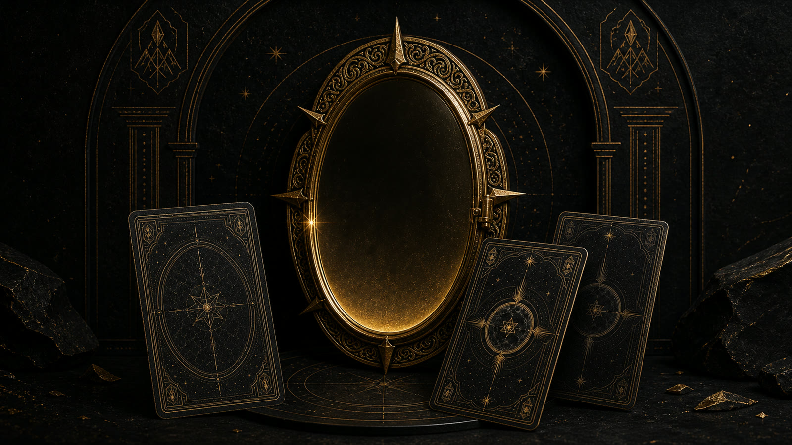
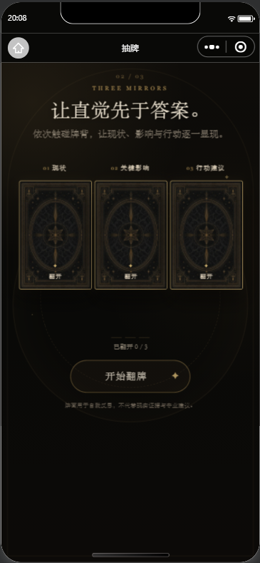
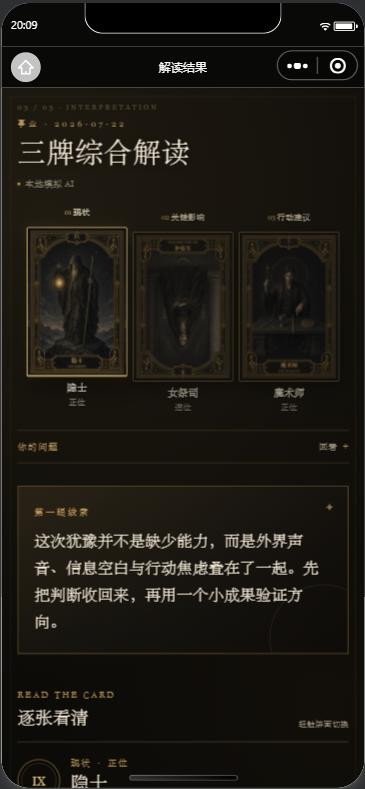
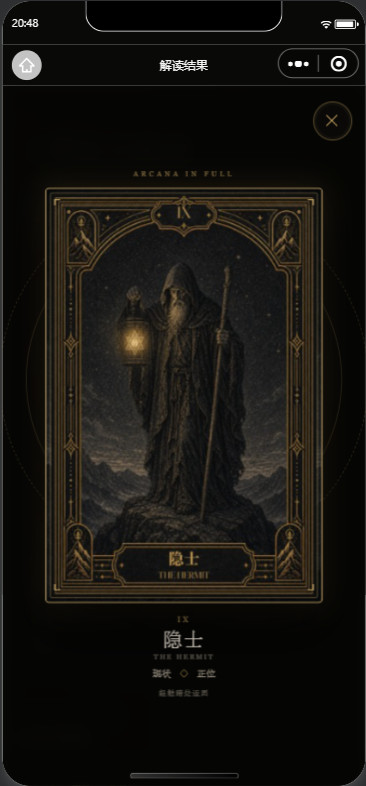
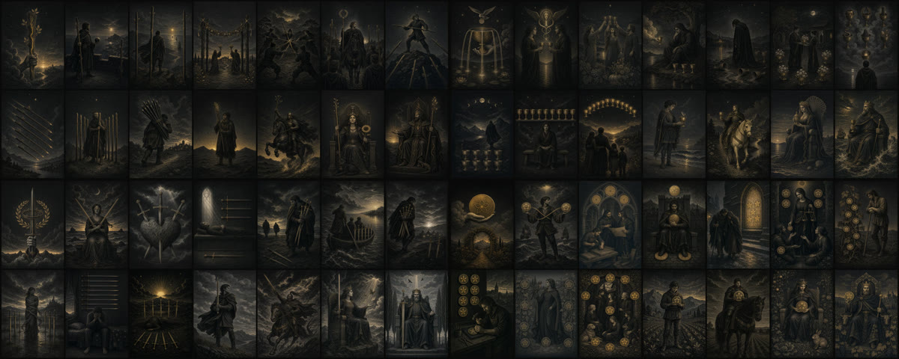

  <strong>English</strong> · <a href="README.zh-CN.md">简体中文</a>

  

<h1 align="center">Arcana Mirror · 心镜拾光</h1>

  Turn a card. See yourself more clearly. 
  A WeChat Mini Program built around visual cards, progressive reading, and bounded AI interpretation.

  
  
  
  
  

Arcana Mirror is not a tool for predicting answers. It treats randomly drawn illustrated cards as prompts for reflection: first noticing an immediate response, then using bounded card meanings, a concrete question, and one small action to turn a vague feeling into something easier to examine.

The repository covers an end-to-end product journey—from product definition and an original 78-card deck to native WeChat interactions, CloudBase AI integration, safety validation, graceful fallback, and asset quality gates. It is both a working personal project and an engineering case study in keeping a small AI product within honest boundaries.

> For entertainment and self-reflection only. It does not provide psychological, medical, legal, financial, or other professional advice, and it makes no deterministic claims about the future.

## What makes it different

| Design principle | How it works |
| --- | --- |
| Do not rush to an answer | A short drawing ritual leaves room to observe the image and intuition before text unfolds |
| Do not turn AI into an oracle | The model may only organize guidance from the drawn-card facts, positions, and controlled meanings |
| Do not build a wall of text | Three-card readings reveal one card at a time; supporting meanings stay collapsed; life areas use tabs |
| Do not let failure break the experience | Timeouts, invalid JSON, factual mismatches, or safety failures fall back to bounded local content |
| Do not make privacy the product | History stays on the current device; old questions are not read; shared images omit the original question |
| Do not treat 78 images as loose files | Semantic contracts, visual contracts, a shared frame, package boundaries, thumbnails, and per-card QA form one asset pipeline |

## A complete reading experience

  
  &nbsp;
  
  &nbsp;
  

1. Choose a daily, single-card, or three-card reading, then use either question-free life guidance or a specific question.
2. Reveal the cards in sequence. Once drawn, orientation, order, and spread position remain fixed.
3. Begin with a first-glance cue, then move through contextual interpretation, directional insight, and optional supporting meanings.
4. Finish with one reflection question and one small action that can be completed within 24 hours.

The screenshots are captured from real rendering in WeChat DevTools rather than concept mockups. They use synthetic test content and contain no real user data.

## The 78-card Ritual Archive deck

  

The complete deck shares a visual language of coal black, graphite, fibrous paper, and uneven aged gold. All 22 Major Arcana and 56 Minor Arcana cards begin with a semantic definition before visual generation and engineering QA. Titles, numbering, the shared front frame, and upright or reversed presentation are applied deterministically by the client.

- [Deck visual system and asset index](assets/tarot-card-style/README.md)
- [Major Arcana generation handoff](deliverables/style-a-deck-generation-kit/README.md)
- [Minor Arcana generation handoff](deliverables/style-a-minor-arcana-generation-kit/README.md)
- [56-card Minor Arcana QA report](assets/tarot-card-style/minor-arcana/generation-report.md)

## How the system works

~~~mermaid
flowchart LR
    UI["WeChat Mini Program UI"] --> RS["ReadingService"]
    RS --> REPO["Local Repository"]
    RS --> FACTS["Fixed card facts and bounded meanings"]
    FACTS --> AI["CloudBase AI Provider (optional)"]
    AI --> CHECK["Structure · facts · focus · safety validation"]
    CHECK -->|pass| VIEW["Progressive reading"]
    CHECK -->|fail| FALLBACK["Bounded local fallback"]
    FALLBACK --> VIEW
    REPO --> HISTORY["Latest 30 readings on this device"]
~~~

A few deliberately simple invariants shape the implementation:

- Draw facts are generated and fixed first. AI cannot change cards, positions, order, or orientation.
- A specific question enters the structured boundary only as data and cannot override the System Prompt.
- Output must match card names, orientation, spread positions, bounded meanings, and the active mode; invalid content is never shown directly.
- Daily readings are fully local. Single-card and three-card readings also degrade safely when CloudBase is not configured.
- The Mini Program bundle contains no model key, WeChat AppSecret, or console credential.

See the [technical architecture](docs/product/03-technical-architecture.md) and the [CloudBase AI integration and release checklist](docs/development/v1.0-ai-integration.md) for the full contracts.

## Quick start

### Requirements

- Node.js 20+
- npm 10+
- WeChat DevTools

### Install and verify

~~~powershell
git clone https://github.com/chenzhiyong1994/arcana-mirror.git
cd arcana-mirror
npm install
npm run typecheck
npm test
npm run validate:assets
~~~

<code>npm install</code> creates the following two Git-ignored local files from templates when they are missing, without overwriting existing configuration:

- <code>project.config.example.json</code> → <code>project.config.json</code>
- <code>apps/miniprogram/config/cloud.example.ts</code> → <code>apps/miniprogram/config/cloud.ts</code>

Then import the repository root into WeChat DevTools. The open-source template uses <code>touristappid</code> by default, which is enough to explore the local interface and bounded fallback path.

### Bring your own CloudBase AI

1. Add your own Mini Program AppID in WeChat DevTools and create or select a CloudBase environment.
2. Put the environment ID only in the local <code>apps/miniprogram/config/cloud.ts</code>; this file is excluded by <code>.gitignore</code>.
3. Enable CloudBase built-in AI in your environment and confirm that the provider and model configuration are available.
4. To include a Mini Program code in sharing posters, deploy <code>cloudfunctions/api</code> to the same environment.

Available models, plans, and review requirements may differ by account. Do not copy the maintainer's environment identity, and never commit an AppSecret, model key, or console credential to a client-side file.

## Common commands

| Command | Purpose |
| --- | --- |
| <code>npm run setup</code> | Create missing local configuration without overwriting existing files |
| <code>npm run typecheck</code> | Run TypeScript type checking |
| <code>npm test</code> | Run domain, safety, and AI provider contract tests |
| <code>npm run validate:assets</code> | Validate all 78 cards, mappings, dimensions, and package assets |
| <code>npm run build:shared-card-assets</code> | Rebuild shared runtime card assets |
| <code>npm run build:minor-contact-sheets</code> | Rebuild Minor Arcana suit contact sheets |

## Repository structure

~~~text
apps/miniprogram/   Native WeChat app, domain services, and local adapters
cloudfunctions/     CloudBase function used only to generate a Mini Program code
assets/             Brand art, deck sources, runtime images, and README visuals
deliverables/       Major and Minor Arcana generation contracts and handoffs
docs/               Product, architecture, roadmap, release, and QA records
tests/              Domain, safety, AI provider, and interpretation contracts
tools/              Asset builds, configuration setup, and consistency checks
~~~

## Project status

The project is currently a **v1.1 complete-deck release candidate**. Core code, the 78-card deck, asset gates, and the CloudBase AI call path are complete. Production release still requires manual gates for physical-device testing, real AI samples, usage alerts, privacy guidance, and WeChat review. The repository therefore does not present passing local tests as a production-quality guarantee.

The project story starts at the [product documentation index](docs/product/README.md). For a concise tour of the design decisions, see:

- [Product definition and research findings](docs/product/01-product-brief.md)
- [MVP PRD](docs/product/02-mvp-prd.md)
- [v0.3 high-fidelity experience and progressive disclosure](docs/product/09-v0.3-high-fidelity-experience.md)
- [v1.1 complete 78-card deck](docs/product/10-v1.1-complete-78-card-deck.md)

## Contributing

Bug reproductions, accessibility improvements, device compatibility fixes, test coverage, and small documentation corrections are welcome. Please read the [contributing guide](CONTRIBUTING.md) before starting. Security issues should not be disclosed publicly; use the private channel described in the [security policy](SECURITY.md).

The project intentionally stays restrained: community features, payments, human services, larger spreads, and deterministic prediction are out of scope. When proposing a feature, explain how it helps someone observe themselves more clearly—not how it makes the result feel more mysterious.

## License

- Source code under <code>apps/</code>, <code>cloudfunctions/</code>, <code>tests/</code>, <code>tools/</code>, and similar paths is licensed under the [MIT License](LICENSE).
- Original visual assets and deck materials under <code>assets/</code> and <code>deliverables/</code> are licensed under [CC BY-NC-SA 4.0](ASSET_LICENSE.md).
- Use of the project name and logo must not imply endorsement or an official relationship. Third-party dependencies remain under their respective licenses.

If you publish a derivative, use your own Mini Program identity, CloudBase environment, and branding, and preserve all applicable attribution and license notices.
