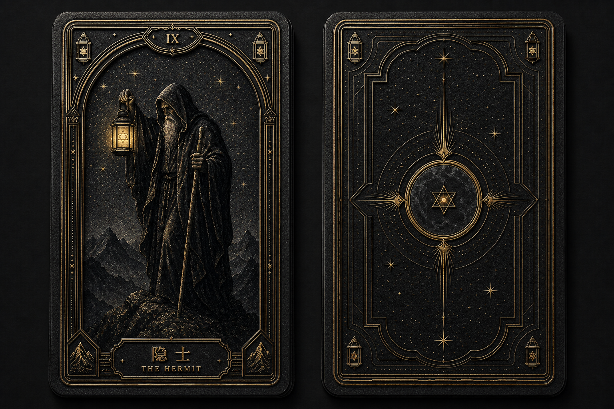
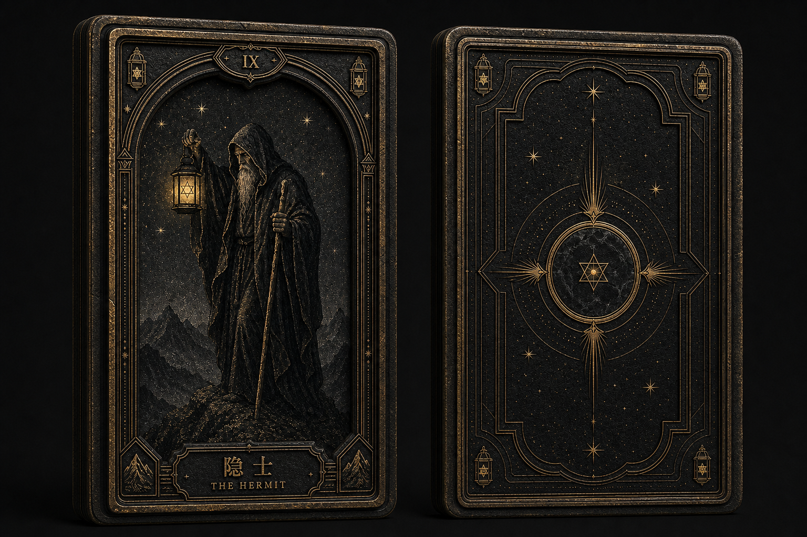
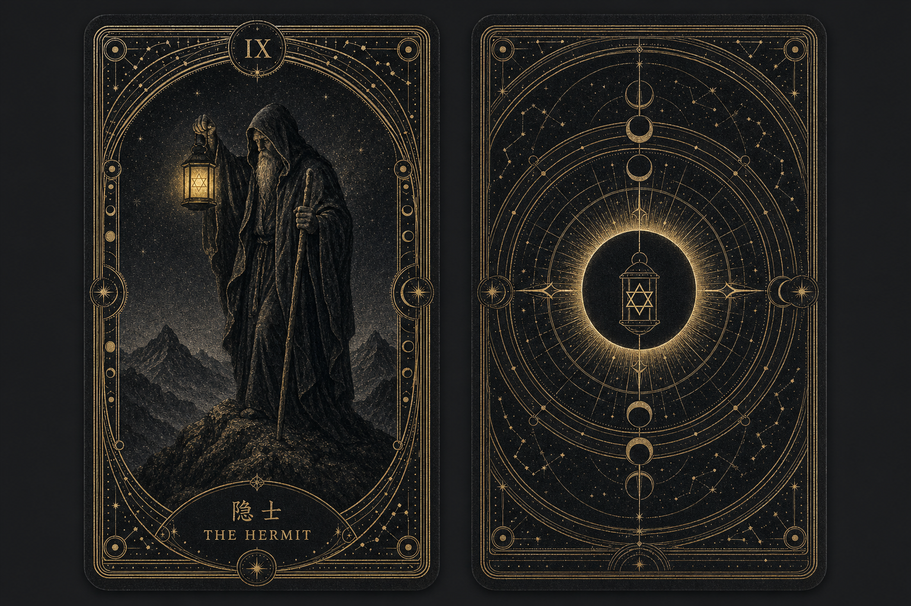
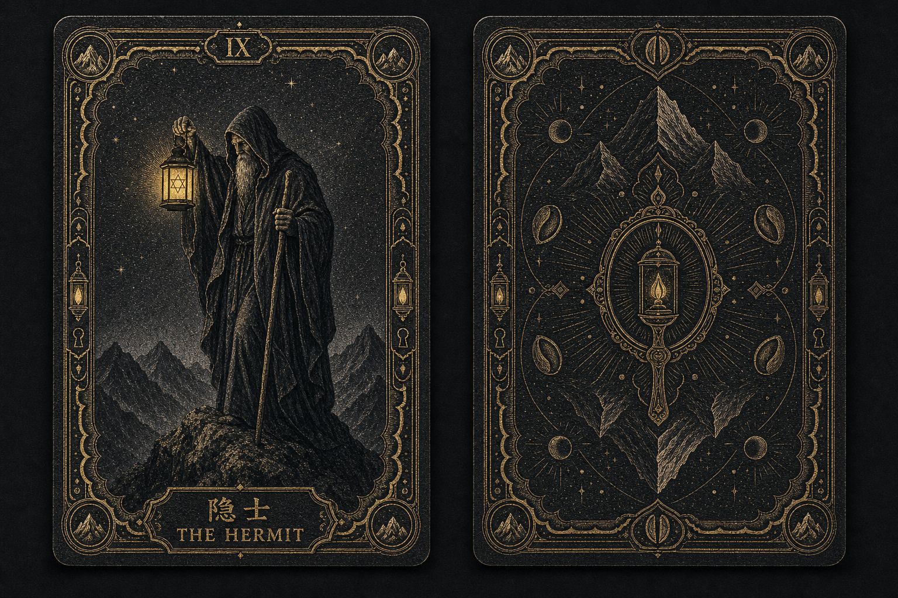

# 卡牌收藏感与正反面探索 V1

## 探索目标

在既定的黑灰手工版画、纤维纸、颗粒油墨和不均匀旧金箔基准上，验证四个新增要求：

1. 所有牌共用一个无法从背面判断正逆位的统一卡背；
2. 正面明确显示编号、中文名称和英文名称；
3. 边框从简单双线升级为可形成系列识别的精致结构；
4. 卡牌具有值得收集的材质层次和套系统一感。

用户提供的实物牌组照片仅作为黑金印刷、精细线条、边框密度和收藏品氛围参考，不复制其牌面、花纹、星盘、文字或构图。既有 `style-hermit-v3.png` 继续作为隐士牌义与材质锚点。

## 三组样张

### A：仪式典藏

- 文件：`style-concept-a-ritual-archive-v1.png`
- 变量：四层发丝框、建筑拱券、灯笼与山峰角章、克制留白、镜面星芒卡背。
- 优势：正面层级最稳，人物仍是视觉中心；缩略图识别和 22 张批量一致性最好。
- 风险：若金线全部保持同等亮度，会略显“高端塔罗通用风”，需要用断箔和局部压暗增加品牌差异。
- 验收：正面人物、灯、杖和山峰清晰；卡背方向隐藏基本成立；中文标题在概念图中存在生成字形风险，正式资产必须由排版层叠加。

#### A2：克制浮雕

- 文件：`style-concept-a2-restrained-relief-v1.png`
- 用户反馈：A 方向成立，但平面感偏强，希望更有立体感和厚重感。
- 单一变量：不改变人物、构图、边框语言或卡背标志，只增加约 1.2—1.5 mm 的深色厚卡边缘、浮起外框、两级内斜面、凹陷画心、压凹标题牌、凸起角章和侧向旧金箔反光。
- 验收：仍然像可翻动、可收集的高级卡牌；边缘、画心和边框之间出现清晰前后层级；人物没有变成立体雕像；整体厚重但未明显偏离 A。
- 建议：作为当前首选，再将外沿视觉厚度增加约 10%，并在实际小程序中用轻微透视、环境阴影和翻牌高光补足动态立体感。

#### A3：深框厚卡

- 文件：`style-concept-a3-deep-frame-relic-v1.png`
- 单一变量：将厚度提高到约 2—2.5 mm，使用三层阶梯边框、深凹画心、更强压印和 5°—7° 透视来突出器物体量。
- 验收：厚重、耐久和圣物感非常明显；原始人物、图标和卡背语言仍可识别。
- 风险：已经接近厚框牌匾或遗物，卡牌的轻盈翻动感下降，边框也更容易压过牌面内容；不建议原样作为首选。

### B：星图圣所

- 文件：`style-concept-b-celestial-sanctuary-v1.png`
- 变量：天体仪轨道、月相刻度、日蚀核心、放射金芒、观测窗式边框。
- 优势：卡背记忆点和翻牌前的期待感最强；在卡片未翻开时也能建立产品识别。
- 风险：细线数量最多，缩小后可能产生摩尔纹或抢走不同牌面的个性；需要简化约 20%—30%。
- 验收：正面识别、标题区域和收藏感成立；卡背需要在最终制作时用确定性镜像结构重建，不能依赖每次生图保证像素级 180° 对称。

### C：秘藏版画

- 文件：`style-concept-c-curio-engraving-v1.png`
- 变量：古籍藏书票结构、扇贝形内框、深压纹、断裂金箔、山峰/灯/种子/钥匙孔小徽记。
- 优势：纸张、压印与限量版手作感最强，最能满足“收藏癖好”。
- 风险：装饰密度偏高，边框开始与主画面争夺注意力；概念卡背没有严格满足 180° 旋转对称。
- 验收：材质与收藏感通过；缩略图层级和卡背方向隐藏不通过，不建议原样作为整套基准。

## 推荐收敛方向

推荐采用 **A 的正面结构 + B 卡背的简化版 + C 的局部断箔与压纹材质**：

- 正面用 A 保持人物优先和批量稳定；
- 卡背保留 B 的日蚀、灯笼与轨道核心，但删除约四分之一细碎星点和轨道；
- 材质继承 C 的纤维、压纹和不均匀断箔，避免过度光滑和商品模板感；
- 金色只服务于编号、标题、核心道具和少量结构线，不能整张平均发亮。

## 正式资产分层

批量生成前必须拆成四层，不让生图模型逐张重做公共元素：

1. **牌面插画层**：每张牌独立生成，只负责人物、道具、姿态、场景和象征；
2. **统一正面边框层**：一份固定透明叠加资产，所有牌共用；
3. **编号与标题层**：由前端或确定性排版生成，确保 `IX / 隐士 / THE HERMIT` 等文字完全正确；
4. **统一卡背层**：一份固定图片，严格像素级双轴与 180° 对称，正逆位不可识别。

翻牌动效只在正面层与统一卡背层之间切换；反面不按卡牌重新生成。

## 生成 Prompt 记录

三组均使用会话内置 imagegen，输入角色如下：

- Image 1：`style-hermit-v3.png`，牌义、人物关系与黑灰旧金材质锚点；
- Image 2：用户提供的黑金实物牌组照片，仅作工艺、边框与收藏氛围参考。

### A Prompt

生成横向正反面对照板；左侧为主流隐士形象，一位年长隐士在高山顶端低头，一手提含六芒星的灯，一手持长杖；右侧为严格双侧与 180° 对称的统一卡背。使用黑灰手工雕版、纤维纸、颗粒油墨和克制旧金箔。正面采用四层发丝框、浅建筑拱券、灯笼与山峰角章、顶部编号框和底部标题框；卡背以暗镜、六芒灯星与四向光线为原创核心。标题要求 `IX / 隐士 / THE HERMIT`，不允许其他文字、额外卡牌、透视、手、包装、星盘布或对参考图的直接复制。

### B Prompt

保持相同隐士与材质，变量只换为天体仪式边框：同心轨道、月相珠、径向刻度、尖拱和星点；卡背以日蚀黑盘、六芒灯星、星盘环和四向光线组成，要求 180° 旋转对称。标题要求 `IX / 隐士 / THE HERMIT`。控制金色为旧金，不使用霓虹蓝紫、塑料高光、星座文字或装饰性伪文本。

### C Prompt

保持相同隐士语义，使用更强的手切木刻、深压纹、断裂旧金箔和古籍藏书票式边框；加入山峰、灯、种子与钥匙孔的原创小徽记。卡背以封闭镜面/入口、灯火、镜像山峰和种子纹构成，要求方向不可辨。标题要求 `IX / 隐士 / THE HERMIT`。禁止复制参考图花卉曼陀罗、黄道图、蒸汽朋克齿轮、亮黄铜或额外文字。

### A2 Prompt

以 A 为编辑目标，锁定隐士人物、灯、杖、山峰、建筑边框、暗镜卡背、配色和双卡布局，只修改物理深度、材质响应与侧光。使用 1.2—1.5 mm 深色棉纸厚卡边缘、浮起外框、两级内斜面、凹陷画心、压凹标题牌、凸起角章、旧金箔微高度、沟槽微阴影和短环境投影；保持接近正视，只用极轻透视展示厚度。禁止新增符号、颜色、道具、金属板、木框、皮革、塑料或珠宝高光。

### A3 Prompt

同样锁定 A 的视觉身份，只把物理结构提高到 2—2.5 mm 分层卡芯、宽厚外护框、三级阶梯斜面、深凹画心、深压标题牌、破损金箔高点与 5°—7° 轻透视。要求保留卡牌属性，不变成石板、木框、金属牌或立体人物雕像。

## 下一步门禁

用户确认正面边框、卡背和材质组合后，先制作一张最终隐士基准与一张独立卡背，验证缩略图、翻牌和正逆位，再固化生成合同；确认前不批量生成 22 张牌。
