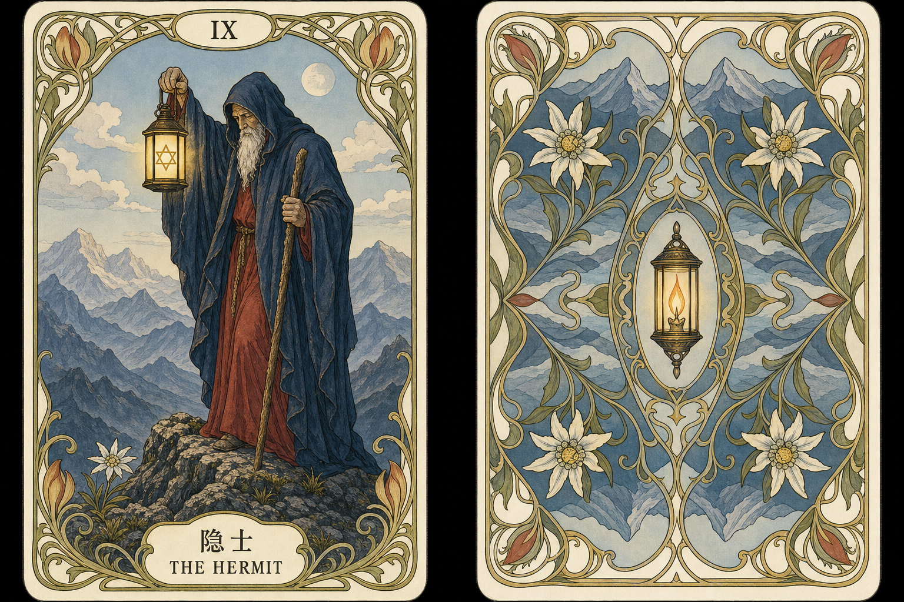

# 卡牌视觉备选记录

> 当前仅保留 A 与 G 两个备选方案。两者均未固化为正式主视觉，确认前不批量生成 22 张牌。

## A：仪式典藏

- 文件：`style-concept-a-ritual-archive-v1.png`
- 视觉语言：煤黑、石墨灰与不均匀旧金；手工版画、纤维纸、颗粒油墨、四层发丝框与仪式性角章。
- 优势：神秘感与典藏感强，人物层级稳定，缩略图轮廓和整套一致性较好。
- 风险：容易接近常见高端黑金塔罗；正式版需要控制金线亮度，并通过断箔与局部压暗建立差异。
- 验收：隐士人物、六芒星灯、长杖和高山关系清楚；正反面结构成立；概念图文字只作示意，正式标题必须由前端叠加。

### A Prompt 摘要

生成横向正反面对照板；正面是一位年长隐士独自在高山顶端低头，一手提含六芒星的灯，一手持长杖；反面是方向不可辨的统一卡背。使用黑灰手工雕版、纤维纸、颗粒油墨和克制旧金箔，配合四层发丝框、浅建筑拱券、灯笼与山峰角章。禁止额外人物、透视展示、包装、星盘布以及对参考图的直接复制。

## G：古典新艺术

- 文件：`style-nouveau-g-classical-v1.png`
- 视觉语言：象牙白、粉灰蓝、午夜蓝、胭脂红、橄榄绿与赭金；清晰黑色轮廓、克制哑光平涂、低颗粒与植物曲线边框。
- 优势：古典叙事清楚，全彩但不杂乱；人物、灯、杖和高山关系明确，屏幕阅读舒适。
- 风险：明亮底色和高山花卉会削弱神秘感；若继续收敛，可将背景压深约 10%，外框枝叶减少约 15%。
- 验收：牌义识别、平面适配、卡背对称、低颗粒与原创性通过；概念图文字只作示意，正式标题必须由前端叠加。

### G Prompt 摘要

以隐士 V3 只锁定一位年长隐士在高山上提六芒星灯、持长杖的牌义；参考用户图片的清晰黑线、哑光平涂、灰蓝/胭脂/象牙/橄榄/赭金配色和新艺术植物曲线边框。生成正视平面正反面对照，卡背使用灯火、高山花和对称枝叶。禁止复制参考牌中的人物身份、服饰、手势、随从、宝座或具体边框。

## 共同生成合同

1. 先定义人物、道具、姿态、场景和关键象征，再应用视觉风格；
2. 正面边框、编号标题和统一卡背使用确定性公共资产，不让模型逐张重做；
3. 编号、中文名和英文名由前端叠加，不能依赖生成图片中的文字；
4. 统一卡背必须严格双轴与 180° 对称，无法从背面判断正逆位；
5. 每次先确认单张基准牌，再扩展同风格牌组；
6. 保持原创，不模仿现有塔罗牌组或具体艺术家。

## 下一步门禁

用户确认 A 或 G 后，先制作一张最终隐士基准与一张独立卡背，验证缩略图、翻牌和正逆位，再决定是否生成其余牌面。
