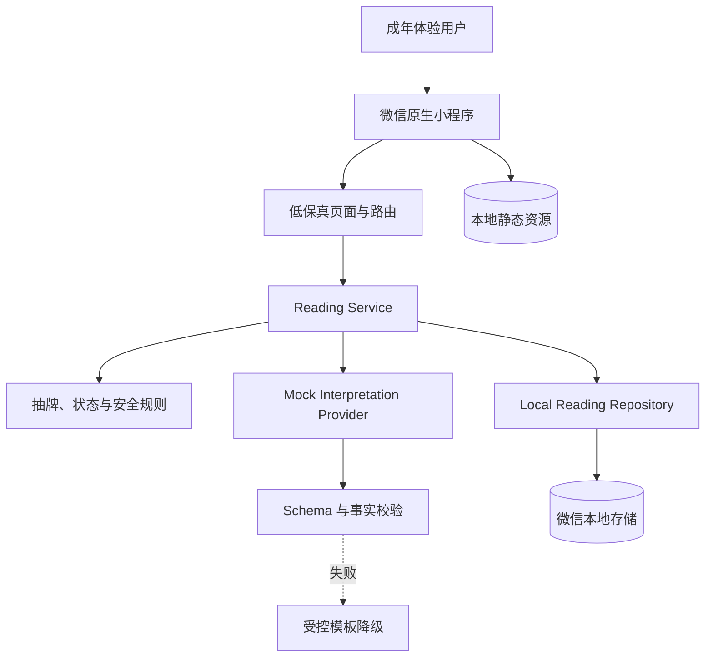
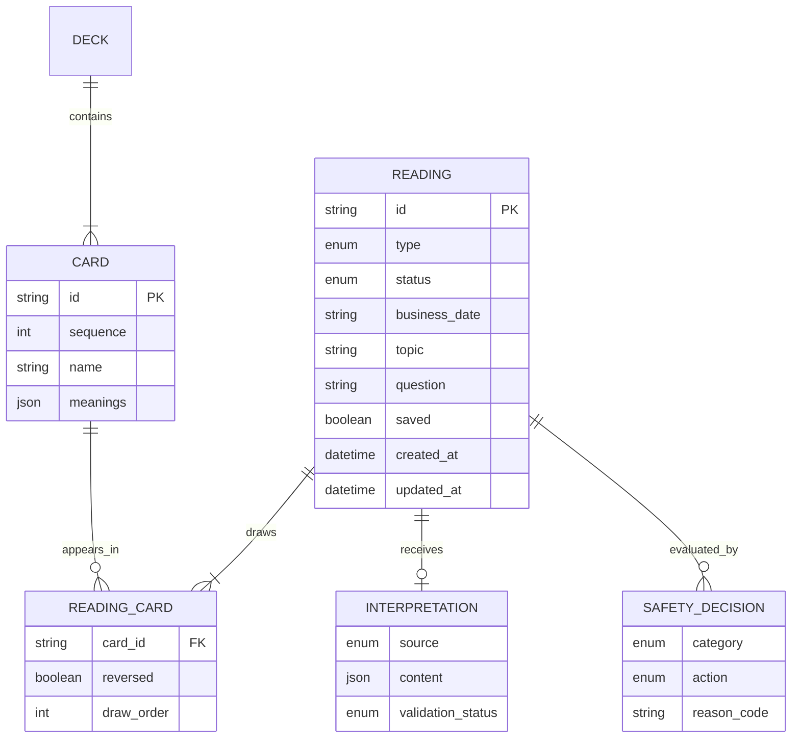
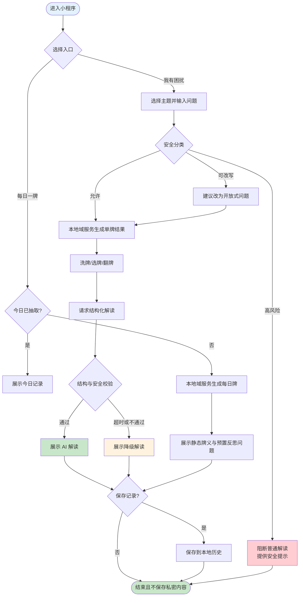
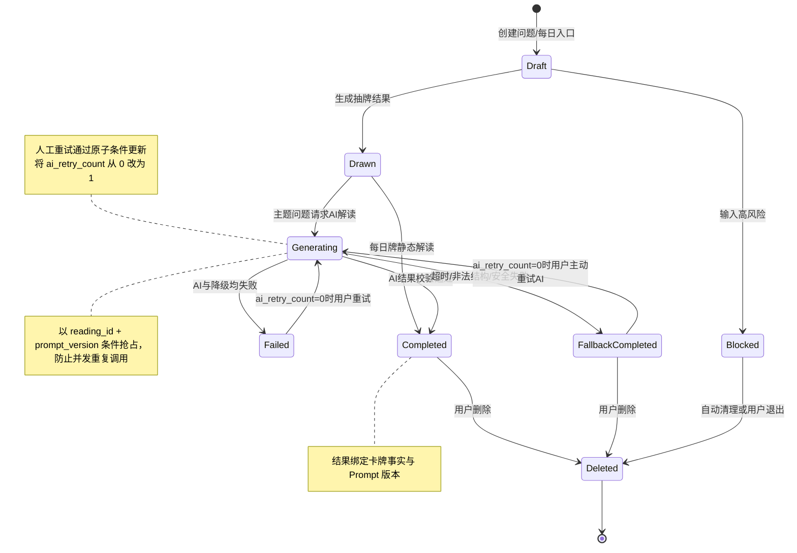

# 阿卡纳心镜：MVP PRD

| PRD 审核人 | Claude Code（claude-opus-4-8）/ Codex |
| --- | --- |
| 重要性 | 高 |
| 紧迫性 | 中 |
| 需求方 | 个人开发者 |
| PRD 编写人 | Codex（待项目作者确认署名） |
| PRD 提交日期 | 2026-07-19 |

## PRD 修改记录

| 变更时间 | 变更内容 | 变更理由 | 修改人 | 审核人 | 版本号 |
| --- | --- | --- | --- | --- | --- |
| 2026-07-19 | 建立 MVP 初稿 | 明确个人作品集项目边界 | Codex | 待审查 | v0.1 |
| 2026-07-19 | 统一 P0/P1、身份与视觉执行口径 | 进入长程开发前消除会误导实现的冲突 | Codex | 项目作者待确认 | v0.2 |
| 2026-07-19 | 本地优先并移除日记 | 先用本地存储和模拟 AI 跑通功能闭环 | Codex | 项目作者确认 | v0.3 |

> 产品定型：**个人自研非商业化 × C 端工具型软件 × 0-1 完整 MVP**。商业分析章节按“同类产品参考与学习收益”调整；复杂 RBAC、交易、多租户和商业运营不适用。

---

## 1、项目背景

### 1.1 项目现状

项目从“做一款塔罗占卜小程序”的模糊想法出发，目标已收敛为个人开发、学习和作品集展示。开发者希望通过一个具备完整用户闭环的项目，积累微信小程序、服务端、数据建模、AI 应用、安全与部署经验。

当前尚无存量系统、存量用户和商业收入约束，可以优先保证边界清晰、工程质量和可演示性。

### 1.2 面临问题

1. **功能同质化**：在线抽牌、牌阵和通用牌义已非常常见，单纯复制无法形成作品特色。
2. **AI 输出不稳定**：情境化解读存在模板化、牌位矛盾、过度确定和不安全建议风险。
3. **个人项目容易失控**：完整 78 张牌、多牌阵、社区、付费、真人服务会显著增加开发和内容成本。
4. **展示价值容易停留在界面层**：如果缺少数据、降级、测试和部署方案，难以体现完整产品和工程能力。

### 1.3 解决思路

围绕“提出困扰—抽牌—情境化解读—记录行动”构建首版闭环；将 AI 限定为解释和反思辅助者，用结构化输出、安全策略、规则校验和本地降级保障体验。MVP 仅覆盖 22 张大阿尔卡那和单牌解读，三牌与回访进入 P1。

### 1.4 决策依据

- 同类产品的差异化主要来自每日仪式、日记沉淀、AI 个性化和牌组 IP，而非单纯增加牌阵数量；
- 个人项目的首要成功标准是完成、上线、可演示和可解释；
- 微信生态对封建迷信、付费预测和误导性内容较敏感；
- AI 内容需要明确标识，并准备高风险输入处理与不可用降级。

> 💡 方法论提示：用“影响作品完成度 × 学习价值 × 实现成本”排序问题，而不是按市场收入排序。

## 2、需求基本情况

| 要素 | 内容 |
| --- | --- |
| 需求提出人 | 个人开发者 |
| 功能使用人 | 18 岁以上、对塔罗和自我探索感兴趣的体验用户 |
| 受影响人 | 测试体验者；未来查看作品的面试官或技术评审者 |
| 发生频率 | 每日一牌高频；主题解读中频；历史回访中低频 |
| 核心痛点 | 通用牌义与具体困扰脱节，看完后缺少可执行的下一步 |
| 需求价值 | 提供完整、自洽、可回顾的自我探索体验，同时形成高质量作品集案例 |

### 2.1 核心场景一：每日一牌

- **人物**：成年体验用户，对塔罗感兴趣但不一定了解牌义；
- **时间**：早晨通勤前、午间休息或睡前；
- **地点**：微信内，移动网络或 Wi-Fi 环境；
- **起因**：想快速获得当天值得关注的提示；
- **经过**：进入首页，点击每日一牌，完成短洗牌和翻牌，查看牌义与反思问题；
- **结果**：可保存一句感受，结果进入日历，同一天默认不重复抽取。

### 2.2 核心场景二：带着困扰进行解读

- **人物**：正面临感情、人际、事业或自我状态困扰的成年用户；
- **时间**：困扰持续出现、需要整理思路时；
- **地点**：相对私密的移动端环境；
- **起因**：用户反复思考但无法形成新角度；
- **经过**：选择主题，输入问题；系统识别高风险内容并帮助改写问题；完成单牌抽取并等待 AI 解读；
- **结果**：获得牌义依据、情境解读、反思问题和一个微行动，可选择保存或删除。

### 2.3 核心场景三：几天后回访

- **人物**：曾保存主题解读和行动的用户；
- **时间**：保存后的第 3—7 天；
- **地点**：用户再次打开小程序时；
- **起因**：历史页显示待回访记录；
- **经过**：用户选择“有帮助/一般/没有帮助”，补充事情进展；
- **结果**：形成个人回顾记录，为后续调整解读质量提供反馈。

## 3、同类产品与方案分析

### 3.1 同类产品参考

| 调研对象 | 核心能力 | 可借鉴点 | 本项目取舍 |
| --- | --- | --- | --- |
| Labyrinthos | 抽牌、学习、日记、趋势、AI | 完整的记录与回看体系 | MVP 不做课程或日记，只保留可选的 Reading 历史 |
| Mystic Mondays | 每日一牌、日历、牌组 IP | 日常仪式和视觉一致性 | 保留每日仪式，原创视觉后置迭代 |
| 塔罗气泡/浮罗绘心 | 沉浸抽牌、主题牌阵、AI | 洗切抽翻的仪式感 | 只做两种牌阵，控制动画时长 |
| Faladdin/Sanctuary | AI/真人对话、额度与付费 | 人格化反馈与持续对话 | 不做真人、付费和无限追问 |
| Cosmic Wheel Sisterhood | 自制牌面、分支叙事 | 牌面可成为故事选择媒介 | 作为远期实验，不进入 MVP |

### 3.2 问题优先级

| 排序 | 问题 | 影响 | 严重度 | 本期策略 |
| --- | --- | --- | --- | --- |
| 1 | AI 解读与牌义/牌位矛盾 | 破坏可信度 | 高 | 结构化输出、规则校验、评估集 |
| 2 | 高风险问题获得不当建议 | 用户安全与平台风险 | 高 | 输入分类、阻断模板、紧急资源提示 |
| 3 | 项目范围过大导致无法完成 | 项目整体 | 高 | 22 张牌、两种牌阵、无商业模块 |
| 4 | AI 服务超时或不可用 | 核心体验 | 中 | 本地组合模板降级 |
| 5 | 视觉缺乏辨识度 | 作品展示 | 中 | 先确定设计系统，再扩展原创牌组 |

### 3.3 学习投入产出

| 维度 | 预期 |
| --- | --- |
| 预计投入 | 单人 6—8 周；每周约 8—10 小时，目标总投入 64—80 小时 |
| 学习收益 | 微信小程序、云函数/服务端、数据库、AI 结构化输出、安全、测试和部署 |
| 作品收益 | 一个可访问演示、完整文档、架构图、测试报告和复盘文章 |
| 范围控制 | 任一阶段延期超过一周时，优先削减视觉扩展和 P1 功能，不削减安全与降级 |

## 4、项目目标

### 4.1 项目目标

| 目标类型 | 目标描述 | 衡量指标 | 目标值 | 时限 |
| --- | --- | --- | --- | --- |
| 交付目标 | 完成可部署、可演示的 MVP | 主流程通过率 | 关键验收用例 100% 通过 | MVP 发布前 |
| AI 质量目标 | 保证解读结构完整且与牌面一致 | 发布评估集结构合格率/硬规则违规率 | 在明确标注样本量的发布评估集上，结构合格率 ≥95%、硬规则违规为 0 | MVP 发布前 |
| 健壮性目标 | AI 异常时主流程不中断 | 降级路径通过率 | 100% | MVP 发布前 |
| 体验目标 | 用户能在短时间完成一次解读 | 单牌主流程耗时 | 不含阅读时间，目标 ≤90 秒 | 内测阶段 |
| 作品集目标 | 完整记录决策与实现 | 文档、测试、演示资料 | 五类材料齐全 | 项目收尾时 |

> 注：以上为设计目标，不是未经验证的事实；内测后应依据真实数据修订。

### 4.2 交付验收标准

1. 可从首页完成每日一牌，并在历史日历中回看；
2. 可输入合规问题，完成单牌抽取，获得结构化解读；
3. 每日牌可自动回看，主题解读可由用户选择保存到本地历史；
4. 高风险输入不会进入普通生成链路；
5. AI 超时、返回非法结构或内容校验失败时能够降级；
6. 本地历史只在当前设备的小程序存储沙箱内可见，并支持单条删除和清空；
7. 本地阶段不需要任何云端或模型密钥，仓库和小程序包内均无密钥；
8. 核心领域逻辑、AI 解析和安全规则有自动化测试。

### 4.3 项目成功标准

发布测试版后两周内，完成至少 5 位体验者、每人至少 2 次主流程测试；收集完成率、解读有用性、理解难点和异常记录，并输出一次项目复盘。样本仅用于发现问题，不用于证明市场需求。

## 5、项目方案概述

### 5.1 核心功能

| 序号 | 模块 | 说明 | 优先级 |
| --- | --- | --- | --- |
| 1 | 首页与每日一牌 | 今日入口和最近记录；每日牌使用静态牌义，不调用 LLM | P0 |
| 2 | 问题输入与安全分类 | 主题选择、问题改写、高风险识别 | P0 |
| 3 | 抽牌仪式 | 洗牌、选牌、翻牌、正逆位 | P0 |
| 4 | AI 情境解读 | 结构化解读、依据、反思与行动 | P0 |
| 5 | 本地降级解读 | AI 不可用时组合牌义与牌位模板 | P0 |
| 6 | 本地历史 | 用户选择保存主题解读，支持回看和删除；每日牌自动保存 | P0 |
| 7 | 三牌解读 | 情况—阻碍—建议三牌牌阵 | P1 |
| 8 | 回访反馈 | 3—7 天后的结果回顾 | P1 |
| 9 | 牌库 | 22 张大阿尔卡那的基础牌义 | P1 |
| 10 | 分享图 | 隐私安全的牌面和启示图片 | P1 |

### 5.2 方案概述

- **产品方案**：以两条主路径“每日一牌”和“带着困扰解读”满足高频轻体验与中频深体验。
- **当前技术方案**：先由微信小程序本地领域服务完成抽牌、安全策略、模拟解读和本地存储；后续以相同契约替换为 CloudBase 与真实 AI。
- **验证方案**：功能测试、AI 离线评估集和小规模体验测试共同验证。

### 5.3 MVP 范围

**包含：**22 张大阿尔卡那、正逆位、单牌、每日一牌、主题解读、结构化模拟解读、本地降级、可选本地历史、安全分类，以及支持定位故障的最小日志。

**暂不包含：**日记、CloudBase、真实 AI、账号系统、三牌及更多牌阵、56 张小阿尔卡那、回访、完整埋点体系、自动化 E2E、真人服务、社区、支付、会员、广告、星盘/八字、复杂提醒、卡牌养成、运营后台。

**核心验证假设：**

1. 情境化解读比通用牌义更容易让体验者感到“与问题有关”；
2. “反思问题 + 微行动”能让解读形成明确结束，而不是诱导不断补牌；
3. AI 降级后仍能完成基本体验；
4. 单人可以在 6—8 周内完成该范围。

## 6、项目范围

### 6.1 涉及系统

| 系统 | 关系 | 影响 | 责任方 |
| --- | --- | --- | --- |
| 微信小程序 | 用户端 | 页面、动效、本地缓存 | 个人开发者 |
| 应用服务端 | 主体服务 | 业务 API、安全、AI 编排 | 个人开发者 |
| 数据存储 | 数据层 | 用户记录、牌库、解读和日志 | 个人开发者 |
| 大模型服务 | 外部依赖 | 生成情境化解读 | 第三方模型提供方/个人开发者 |
| 对象存储 | 外部依赖 | 分享图或静态资源 | 云服务商 |

### 6.2 影响范围

- **用户影响**：仅测试体验者；不面向未成年人主动推广；
- **流程影响**：新建产品，无旧流程迁移；
- **数据影响**：每日牌自动保存在本地；主题问题、抽牌与解读仅在用户明确选择后进入本地历史，均视为私密内容；
- **外部影响**：本地阶段不依赖微信登录、云服务或大模型；
- **部署影响**：本地阶段只要求微信开发者工具可编译运行。

### 6.3 不在本期范围

1. 商业化与支付；
2. 真人咨询与用户间沟通；
3. UGC 社区和公开评论；
4. 专业心理测评、医疗建议或危机干预服务；
5. 完整内容管理后台；
6. 原生 App、H5 和多端账号同步；
7. 高可用多地域部署和企业级运维体系。

## 7、项目风险

### 7.1 前提假设

| 编号 | 假设 | 不成立的影响 |
| --- | --- | --- |
| A1 | 微信小程序能够以“娱乐/自我探索”口径通过测试与审核 | 需调整为 H5 或仅保留开发版演示 |
| A2 | 开发者可使用至少一个支持结构化输出的大模型服务 | 需扩大本地模板解读能力 |
| A3 | 22 张大阿尔卡那足以支撑 MVP 展示 | 若体验单调，需提前扩展小阿尔卡那 |
| A4 | 测试体验者愿意提供匿名反馈 | 缺少真实体验验证，只能做自测 |

### 7.2 约束条件

| 编号 | 约束 | 对设计的影响 |
| --- | --- | --- |
| C1 | 单人、业余时间开发（64—80 小时首版预算，80 小时硬上限） | 当前使用本地 Repository 与模拟 Provider；超期触发范围熔断 |
| C2 | 非商业化 | 不做支付、广告、会员和商业运营 |
| C3 | 私密问题数据 | 最小化采集、默认私密、支持删除 |
| C4 | AI 输出不可完全预测 | 结构约束、后置校验、降级和评估必须进入 P0 |

### 7.3 风险清单

| 编号 | 类别 | 风险 | 概率 | 影响 | 应对 |
| --- | --- | --- | --- | --- | --- |
| R1 | 产品 | 用户将开放式解读理解为确定预测 | 中 | 高 | 统一措辞、显著免责声明、禁止确定性结论 |
| R2 | 安全 | 自伤、疾病、投资等问题获得不当回答 | 中 | 高 | 输入分类、输出过滤、阻断与专业资源提示 |
| R3 | 技术 | 模型超时、限流或返回非法 JSON | 高 | 中 | 超时、有限重试、结构校验、本地降级 |
| R4 | 隐私 | 日志或分享图泄露用户问题 | 中 | 高 | 日志脱敏、分享默认隐藏、删除能力 |
| R5 | 内容 | 牌义与视觉资产版权不清 | 中 | 中 | 自编牌义、记录来源、使用原创或明确授权素材 |
| R6 | 工程 | 范围蔓延导致无法完成 | 高 | 高 | 固定 MVP、里程碑门禁、P1 可整体延期 |
| R7 | 平台 | 小程序审核口径变化 | 中 | 高 | 避免敏感宣传；保留 H5/演示视频备选 |

## 8、术语和缩略语

| 术语 | 定义 |
| --- | --- |
| 大阿尔卡那 | 塔罗牌中的 22 张主要牌，本项目 MVP 的牌库范围 |
| 正位/逆位 | 牌面抽取后的朝向，映射不同但非绝对相反的解释 |
| 牌阵 | 卡牌位置的组织方式，每个位置具有独立语义 |
| 情境化解读 | 将用户问题、主题、牌面、牌位和朝向共同用于生成解释 |
| 微行动 | 用户在短时间内可执行、低风险、可回访的一步行动 |
| 降级解读 | AI 不可用或输出不合格时，由预设内容和规则组合出的结果 |
| Prompt Version | 生成提示词的版本标识，用于复现、评估和回滚 |
| Safety Decision | 对一次输入/输出做出的允许、改写、阻断或提示决定 |

## 9、参考文献和引用文档

| 文档 | 位置 | 说明 |
| --- | --- | --- |
| 产品定义与调研结论 | `docs/tarot-mini-program/01-product-brief.md` | 市场模式、定位、用户边界 |
| 技术架构方案 | `docs/tarot-mini-program/03-technical-architecture.md` | 部署、数据、AI 与安全设计 |
| 开发路线 | `docs/tarot-mini-program/04-development-roadmap.md` | 里程碑、任务和作品集产出 |
| 人工智能生成合成内容标识办法 | 中国网信网 | AI 内容标识依据 |

## 10、功能需求

### 10.1 产品框架概述

#### 10.1.1 应用架构图

#### 10.1.2 数据模型图

关键数据规则：

| 实体 | 规则 |
| --- | --- |
| Reading | 每日牌自动保存；主题牌仅在用户确认后进入历史；删除后立即从本地存储移除 |
| ReadingCard | 抽牌事实一经生成即不可变；同一次牌阵不重复；朝向独立随机 |
| Interpretation | 保存结构化结果、来源（AI/降级）和验证状态，不保存模型内部思维过程 |
| SafetyDecision | 只记录类别、动作和原因码；安全日志不复制完整私密问题 |
| PromptVersion | 一次解读绑定固定版本，便于评估和回滚 |

#### 10.1.3 核心流程

#### 10.1.4 Reading 状态机

状态转换表：

| 当前状态 | 事件 | 目标状态 | 操作方 | 前置条件 | 后置影响 |
| --- | --- | --- | --- | --- | --- |
| Draft | 安全阻断 | Blocked | 系统 | 命中高风险规则 | 不调用普通解读模型 |
| Draft | 确认抽牌 | Drawn | 用户/系统 | 牌阵有效 | 固化卡牌、牌位和朝向 |
| Drawn | 生成每日静态解读 | Completed | 系统 | reading.type=daily | 不调用 LLM，组合受控牌义 |
| Drawn | 请求解读 | Generating | 系统 | 安全通过 | 创建幂等生成任务 |
| Generating | 校验通过 | Completed | 系统 | JSON、牌义和安全校验通过 | 保存 AI 结果 |
| Generating | 降级成功 | FallbackCompleted | 系统 | AI 超时或校验失败 | 保存降级结果和原因码 |
| Generating | 全部失败 | Failed | 系统 | 降级也失败 | 展示可重试错误 |
| FallbackCompleted | 主动重试 AI | Generating | 用户 | `ai_retry_count=0` 且 reading.type=question | 原子条件更新将计数改为 1 并抢占状态 |
| Failed | 主动重试 AI | Generating | 用户 | `ai_retry_count=0` 且 reading.type=question | 原子条件更新将计数改为 1 并抢占状态 |
| Completed/FallbackCompleted | 删除 | Deleted | 用户 | 记录归属本人 | 用户侧立即不可见，触发清理 |

`ai_retry_count` 在 Reading 创建时初始化为 0，只统计用户发起的前台重试，不统计 Provider Adapter 内对瞬时错误的一次传输重试。服务端以“当前状态属于 `FallbackCompleted/Failed` 且 `ai_retry_count=0`”作为同一条原子条件更新；未抢占成功的并发请求复用已存在任务或返回当前状态。

状态字段与操作矩阵：

| 状态 | 问题/主题 | 抽牌事实 | 解读 | 保存历史 | 重试 | 删除 |
| --- | --- | --- | --- | --- | --- | --- |
| Draft | 可编辑 | 不可见 | 不可见 | 不可用 | 不可用 | 可退出 |
| Blocked | 只读/可返回改写 | 不生成 | 展示安全提示 | 不可用 | 可改写后新建 | 可退出 |
| Drawn | 只读 | 只读 | 加载前 | 不可用 | 不可用 | 可退出并清理草稿 |
| Generating | 只读 | 只读 | 加载中 | 不可用 | 超时后可用 | 可退出；退出仅停止前台展示，重进复用同一任务/结果 |
| Completed | 只读 | 只读 | 可见 | 可用 | 不可用 | 可用 |
| FallbackCompleted | 只读 | 只读 | 可见并标注降级 | 可用 | 可重新请求 AI 一次 | 可用 |
| Failed | 只读 | 只读 | 错误态 | 不可用 | 可用，最多 1 次前台重试 | 可用 |
| Deleted | 不可见 | 不可见 | 不可见 | 不可用 | 不可用 | 已完成 |

#### 10.1.5 页面清单

| 模块 | 页面/组件 | 小程序端 | MVP |
| --- | --- | --- | --- |
| 首页 | 今日入口、主题入口、最近记录；待回访入口为 P1 | ✓ | P0/P1 |
| 提问 | 主题选择、问题输入、问题改写、安全提示 | ✓ | P0 |
| 抽牌 | 静心提示、洗牌、选牌、翻牌 | ✓ | P0 |
| 解读 | 总览、逐牌依据、反思问题、微行动 | ✓ | P0 |
| 历史 | 保存选择、列表、详情和删除 | ✓ | P0 |
| 牌库 | 22 张牌列表与详情 | ✓ | P1 |
| 设置 | 隐私说明、AI 标识、数据删除、关于项目 | ✓ | P0 |

### 10.2 产品需求详解

#### 10.2.1 首页与每日一牌

**页面要素：**今日卡入口、主题解读入口、最近三条记录、隐私/AI 标识入口。待回访入口为 P1。

| 操作 | 触发条件 | 反馈 | 规则 |
| --- | --- | --- | --- |
| 点击每日一牌 | 今日未抽 | 进入短仪式 | 以本地 Asia/Shanghai 业务日期判定每日唯一 |
| 点击每日一牌 | 今日已抽 | 打开今日详情 | 不允许通过刷新重复抽取 |
| 点击主题入口 | 无 | 进入提问页 | 本地阶段不登录；主题结果由用户明确决定是否保存 |
| 点击待回访（P1） | 存在到期记录 | 进入回访页 | 首页最多展示一个最早到期入口 |

业务规则：

| 编号 | 类型 | 规则 |
| --- | --- | --- |
| H-R1 | 约束 | 当前设备中的该小程序每个自然日只生成一张每日牌 |
| H-R2 | 推论 | 本地阶段不获取 OpenID、昵称、头像或手机号 |
| H-R3 | 触发 | 用户首次保存私密问题前展示隐私说明并取得必要确认 |

#### 10.2.2 问题输入与安全分类

**字段：**

| 字段 | 类型 | 必填 | 规则 |
| --- | --- | --- | --- |
| 主题 | 单选 | 是 | 感情/人际/事业/自我；不提供健康、财运预测等主题 |
| 问题 | 多行文本 | 是 | 5—200 个字符；首尾空格清理；拒绝纯符号和重复垃圾内容 |
| 使用改写 | 布尔 | 否 | 用户明确确认后替换原问题 |

**安全动作：**

| 分类 | 示例方向 | 动作 |
| --- | --- | --- |
| 允许 | “我该如何理解最近和同事的冲突？” | 进入牌阵推荐 |
| 建议改写 | “他一定会和我复合吗？” | 改写为关注自身选择和边界的开放问题 |
| 专业建议 | 医疗、法律、投资的具体判断 | 不给结论，提示咨询相应专业人士，可改为情绪整理问题 |
| 高风险阻断 | 自伤、自杀、伤害他人、紧急危险 | 停止普通流程，鼓励立即联系当地紧急服务和可信赖的人 |
| 禁止滥用 | 赌博、违法、操纵他人 | 拒绝并结束流程 |

#### 10.2.3 抽牌仪式

流程：静心提示（可跳过）→洗牌动效→牌背选择→翻牌→展示牌名、朝向和牌位。

| 规则 | 说明 |
| --- | --- |
| 随机来源 | 本地阶段由领域服务生成；后续云端替换为服务端安全随机，客户端动画始终不决定结果 |
| 唯一性 | 同一牌阵内同一张牌不能重复 |
| 正逆位 | 每张牌独立生成朝向；MVP 默认约 50/50，可通过配置调整但不为用户动态操纵 |
| 事实一致性 | 解读只引用 Reading 中已固化的卡牌事实，页面不能提交任意卡牌替换结果 |
| 动画 | 支持减少动态效果；动画完成前结果已被服务端固化，退出重进仍保持一致 |

#### 10.2.4 AI 情境解读

> 💡 确定性-容错率分析：这是探索性、相对高容错但涉及情绪安全的任务，采用“CUI 能力嵌入固定 GUI 结果页”，不使用全对话替代界面。

模拟 AI 仅用于主题问题解读；每日一牌使用静态牌义和预置反思问题。模拟输入只包含问题、主题、牌阵、卡牌、牌位、朝向和受控牌义摘要，不包含任何账号资料或历史记录。

AI 必须返回以下结构：

| 字段 | 类型 | 规则 |
| --- | --- | --- |
| summary | string | 60—160 字，概括当前值得关注的张力 |
| cards | array | 数量与抽牌数一致；逐张包含牌名、牌位、依据和情境解释 |
| reflection_question | string | 只能有一个开放式反思问题 |
| micro_action | string | 一个 24—72 小时内可执行、低风险、非操纵他人的行动 |
| disclaimer | string | 固定免责声明，由服务端覆盖而非完全相信模型输出 |

生成后校验采用“确定性三子层 + 可选增强层”：确定性子层依次校验 JSON Schema、牌面语义一致性和明确安全规则（长度、空字段、禁用词/正则）；增强层可使用独立模型分类识别更隐晦的医疗、法律、金融、恐吓、操纵和自伤内容。任何校验失败都不直接展示原始输出，而是进入安全模板、阻断或降级。

人机边界：模拟 AI 提供解释草稿，用户可以不认同、不保存或删除记录；产品不展示虚构置信度，不保存或展示模型思维链。

#### 10.2.5 解读结果与降级

结果页从上到下展示：AI 生成标识与免责声明、主题总结、逐牌解释、反思问题、微行动、保存/不保存。

| 状态 | 交互 |
| --- | --- |
| AI 生成中 | 骨架屏 + 阶段文案；超过阈值显示“仍在整理” |
| AI 成功 | 展示完整结构，允许保存、复制微行动 |
| 降级成功 | 明示“当前使用基础牌义组合”，仍允许保存 |
| 生成失败 | 说明未扣除任何权益（本项目无付费），提供一次重试或返回 |
| 内容安全失败 | 不展示原始内容，切换安全模板或阻断 |

降级内容组成：牌位说明 + 对应朝向的受控牌义 + 固定反思问题模板 + 主题相关的通用安全行动。降级结果不得伪装成 AI 个性化解读。

#### 10.2.6 本地历史

交互规则：

- 每日牌自动保存，用于当天复用；
- 主题解读默认不保存，用户点击“保存到历史”后才持久化；
- 保存成功使用 Toast，并立即更新历史列表；
- 删除使用模态确认，明确“删除后不可在小程序内恢复”；
- 历史详情默认折叠原始问题，避免在公共场景直接暴露；
- 本地历史只存在当前设备的微信小程序存储沙箱，不跨设备同步；
- MVP 不设计显式登录、账号系统或本地历史自动迁移。

#### 10.2.7 牌库与设置

牌库支持按序号浏览 22 张大阿尔卡那，详情展示图像、关键词、正位含义、逆位含义和一个自我反思问题。MVP 不提供系统课程、考试或收藏成长体系。

设置页包含：模拟 AI 说明、娱乐与自我探索声明、本地数据说明、清空本地历史、项目版本和素材说明。

### 10.3 异常情况处理

| 异常类型 | 场景 | 处理方案 |
| --- | --- | --- |
| 弱网/断网 | 抽牌前断网 | 不开始服务端抽牌；提示检查网络；问题草稿保留本地 |
| 弱网/断网 | 抽牌已完成、解读中断 | 以 reading_id 恢复同一结果，不重新抽牌 |
| 重复点击 | 连续点击生成 | 幂等键阻止重复任务，按钮进入 loading |
| AI 超时 | 超过服务端超时阈值 | 仅重试一次；随后使用降级解读 |
| AI 非法结构 | JSON 缺字段或牌面不一致 | 不展示原始输出；记录原因码并降级 |
| AI 不安全输出 | 命中输出过滤 | 使用安全模板或阻断，不保存原始输出 |
| 服务端异常 | AI 和降级都失败 | 进入 Failed，保留抽牌事实，允许一次重试 |
| 本地存储不可用 | 写入或读取失败 | 当前结果仍可查看；明确提示未保存，不伪装成功 |
| 数据冲突 | 同记录多端更新 | MVP 使用最后写入覆盖并记录 updated_at；后续可增加版本号 |
| 数据删除 | 删除请求中途失败 | 用户侧先隐藏；CloudBase 定时触发函数扫描 `deleted_at/expire_at`，重试物理清理并记录失败次数 |
| 极端输入 | 超长、特殊字符、提示词注入 | 长度限制、Unicode 规范化、输入作为数据字段隔离，不拼接为系统指令 |
| 空状态 | 无历史/无回访 | 展示解释性空状态和开始入口 |
| 静态资源失败 | 牌图加载失败 | 展示本地占位图和牌名，不阻断解读 |

## 11、数据埋点

### 11.1 埋点目标

回答三个问题：用户能否完成核心流程、在哪一步退出、AI 解读是否被认为有帮助。埋点不采集原始问题、笔记和模型完整输出。

### 11.2 事件设计

| 事件 | 触发 | 参数 | 用途 |
| --- | --- | --- | --- |
| home_view | 首页展示 | auth_mode, has_daily, pending_checkin | 首页状态 |
| reading_start | 进入提问/每日流程 | reading_type, topic | 入口分布 |
| safety_decision | 安全分类完成 | category, action, reason_code | 安全效果，不传原文 |
| draw_complete | 抽牌完成 | spread_code, card_count, duration_ms | 抽牌完成率 |
| interpretation_complete | 解读可展示 | source, latency_ms, validation_status | AI/降级表现 |
| interpretation_exit | 结果前退出 | stage, elapsed_ms | 放弃位置 |
| history_save | 用户保存主题解读 | reading_type, source | 记录保存选择 |
| checkin_complete | 完成回访 | helpfulness, days_after | 有用性反馈 |
| reading_delete | 删除记录 | reading_type, age_days | 数据控制使用情况 |
| error_shown | 错误展示 | error_code, stage, recoverable | 稳定性 |

### 11.3 指标

| 指标 | 计算 |
| --- | --- |
| 主流程完成率 | interpretation_complete / reading_start |
| AI 降级率 | source=fallback / interpretation_complete |
| 结果保存率 | history_save / interpretation_complete |
| 回访完成率 | checkin_complete / 到期可回访记录 |
| 有帮助率 | helpfulness=helpful / checkin_complete |
| 安全阻断率 | action=block / safety_decision |
| 错误恢复率 | 错误后成功完成的 reading / recoverable error |

## 12、角色和权限

### 12.1 角色

| 角色 | 说明 | 数据范围 |
| --- | --- | --- |
| 体验用户 | 通过微信云环境获得稳定的伪匿名主体标识；不申请昵称、头像或手机号 | 仅本人数据 |
| 个人开发者 | 维护代码、配置与去标识运行指标 | 产品内不提供私密内容浏览后台；但开发者理论上拥有云资源管理权限，不能宣称端到端或零知识加密 |

### 12.2 功能权限

| 功能 | 体验用户 | 开发者 |
| --- | --- | --- |
| 每日一牌/主题解读 | ✓ | 测试 |
| 本人历史 | ✓ | — |
| 删除本人记录 | ✓ | 不可代用户从产品内操作 |
| 修改 Prompt/牌义配置 | — | 代码或受控配置 |
| 查看聚合指标 | — | ✓，不含原始私密内容 |

### 12.3 安全规则

- 所有读写接口校验记录归属，禁止仅凭 reading_id 访问；
- 小程序端不保存模型密钥、服务端密钥和微信 AppSecret；
- 日志不记录原始问题、笔记、完整解读和身份标识；
- 测试数据使用合成内容，禁止把真实私密数据提交到仓库。

## 13、发布与验证计划

| 阶段 | 范围 | 目标 | 退出标准 | 回退 |
| --- | --- | --- | --- | --- |
| 本地原型 | 开发者 | 验证信息架构与抽牌交互 | 主路径可点击 | 回到静态原型 |
| 开发版 | 开发者 | 验证服务端、AI 和数据闭环 | 自动化测试通过 | 使用本地 mock |
| 内测版 | 3—5 位可信体验者 | 发现理解、隐私和异常问题 | 无 P0/P1 未处理问题 | 暂停分享测试码 |
| 体验版 | 5—10 位体验者 | 收集小规模定性反馈 | 完成复盘与修订 | 回滚上一稳定版本 |
| 作品集版 | 面试/展示 | 稳定演示产品和技术决策 | 演示脚本、文档、视频齐全 | 使用录屏备份 |

反馈渠道使用项目仓库 Issue 模板或独立匿名表单；不在产品内建设客服系统。每个里程碑进行一次范围复盘和风险更新。

## 14、待决事项

| 编号 | 待决事项 | 涉及章节 | 负责人 | 决策时间 | 状态 |
| --- | --- | --- | --- | --- | --- |
| TBD-1 | 正式产品名称与视觉关键词 | 5/10 | 项目作者 | 原型前 | 已确认：阿卡纳心镜；黑灰版画、纤维纸、旧金箔 |
| TBD-2 | 确认 CloudBase 套餐、资源地域与预算 | 6/10 | 项目作者 | 工程搭建前 | 方案默认 CloudBase |
| TBD-3 | 选择 1 主 1 备境内可达模型与预算上限 | 7/10 | 项目作者 | AI Spike 第 0 项 | 待确认；属于 go/no-go |
| TBD-4 | 22 张牌使用何种原创/授权视觉资产 | 7/10 | 项目作者 | UI 开发前 | 已定原创生成方向；V3 为基准，剩余牌逐张验收 |
| TBD-5 | 本地历史是否迁移到云端 | 10/12 | 项目作者 | 云端阶段前 | 已决：默认不自动迁移 |
| TBD-6 | 是否以真实小程序审核上线为里程碑 | 6/13 | 项目作者 | 内测前 | 待确认 |

---

## 附：生成后自检

| 风险项 | 状态 | 说明 |
| --- | --- | --- |
| R1 产品定位 | 已覆盖 | 明确成年用户、自我探索和非预测边界 |
| R2 核心流程 | 已覆盖 | 包含正常、安全阻断、AI 降级和回访路径 |
| R3 ER 模型 | 按工具型产品降低要求后已覆盖 | 提供关键数据结构和关系 |
| R4 角色权限 | 已覆盖 | 体验用户与开发者边界明确，并诚实说明云资源管理员能力 |
| R5 功能致命缺口 | 暂未发现 | AI 不可用仍有降级闭环 |
| R6 需求与目标脱节 | 暂未发现 | 功能围绕学习和作品集目标裁剪 |
| R7 合规风险 | 已覆盖但需上线前复核 | 已定义表达、安全和平台备选方案 |
| R8 SaaS 多租户 | 不适用 | 非商业化、非 SaaS |

### 必须在开发前补齐

1. 验证 CloudBase 地域中的模型可达性和中文结构化输出；该项不通过不得进入正式开发；
2. 确认牌面素材授权或原创计划；
3. MVP 建立 20 条发布评估集，其中 10 条作为日常快检；三牌进入 P1 后扩展到 40 条以上；
4. 把微信平台审核口径作为上线前独立检查项，而不是只依赖免责声明。
