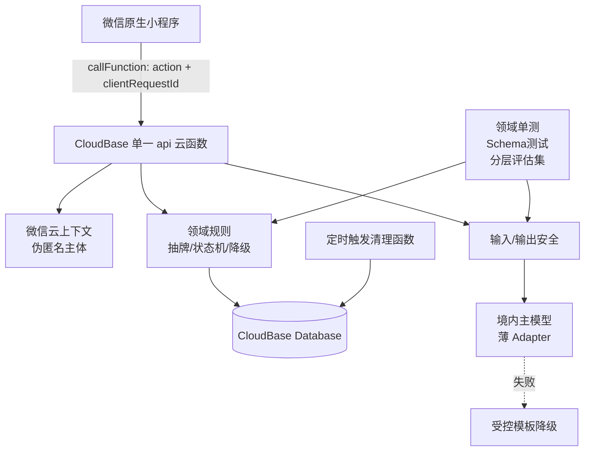

# 阿卡纳心镜：Claude Opus 4.8 架构审查与修订记录

## 1. 审查信息

| 项目 | 内容 |
| --- | --- |
| 审查工具 | Claude Code CLI 2.1.119 |
| 审查模型 | `claude-opus-4-8` |
| 审查角色 | 资深软件架构师与 AI 产品安全评审者 |
| 审查日期 | 2026-07-19 |
| 审查方式 | 只读完整阅读产品定义、MVP PRD、技术架构和开发路线；不允许直接修改文件 |
| 审查重点 | 单人可行性、数据与状态一致性、CloudBase、幂等、随机性、隐私删除、LLM 安全与降级、测试、作品集价值 |

## 2. 总体结论

Claude 的结论是：初稿边界总体克制、安全和降级意识较强，但原 P0 范围仍超过约 80 小时的个人项目预算；同时 CloudBase 与 REST 契约、每日牌与 AI 输入、删除承诺与清理执行、状态机与重试规则之间存在实现冲突。

这些问题如果不在开发前修订，最可能导致“功能很多但每项都不完整”，或者在工程中途重写传输、身份与状态管理。

## 3. 发现与处理

| 编号 | 级别 | Claude 发现 | 处理决定 | 已落地修订 |
| --- | --- | --- | --- | --- |
| C-01 | P0 | P0 功能约 150—250 小时，与 6—8 周、每周 8—12 小时不匹配 | 接受 | MVP 改为单牌；三牌、回访、完整埋点、自动 E2E 和扩展评估集进入 P1；增加 80 小时熔断 |
| C-02 | P0 | CloudBase `callFunction` 与 REST 路径、Header 幂等不兼容 | 接受 | 锁定单一 `api` 云函数 + action 路由；幂等键统一为请求体 `clientRequestId` |
| C-03 | P0 | 境内 CloudBase 对模型的可达性和结构化输出尚未验证 | 接受 | 升级为 Spike 第 0 号 go/no-go；要求 1 主 1 备境内可达模型 |
| C-04 | P1 | 每日一牌无问题/主题，却被送入同一 AI 流水线 | 接受 | 每日牌改为受控静态牌义 + 预置反思问题，不调用 LLM |
| C-05 | P1 | `FallbackCompleted` 可重试但状态图无迁移；并发 interpret 可重复调用 | 接受 | 补充限一次回迁；以 `reading_id + prompt_version` 条件抢占 `Generating` |
| C-06 | P1 | 软删、临时过期和失败重试没有实际执行组件 | 接受 | 新增 CloudBase 定时触发清理函数；数据补 `expire_at/deleted_at` |
| C-07 | P1 | ER 的 `_ciphertext` 暗示已加密，但架构又承认首版可能不做 | 接受 | 字段改中性命名；明确实际保护级别并诚实说明云管理员理论访问能力 |
| C-08 | P1 | “硬规则违规为 0”缺少判定机制且容易被理解为线上绝对保证 | 接受 | 限定为标注样本量的发布评估集；明确确定性规则与增强模型分类分层 |
| C-09 | P2 | 幂等键命名不一致；日记同时写乐观锁与 last-write-wins | 接受 | 统一 `clientRequestId`；MVP 明确使用 last-write-wins + `updated_at` |
| C-10 | P2 | 客户端匿名 ID 可伪造，无法支撑服务端每日唯一与归属强承诺 | 接受并优化 | 使用微信云上下文提供的稳定 OpenID 派生主体，不申请昵称、头像和手机号 |
| C-11 | P2 | 全套测试金字塔和每次 40 条真实模型评估过重 | 接受 | MVP 必做领域单测、AI Schema/契约测试、手动黄金路径；评估拆为 10 条快检 + 20 条发布集 |
| C-12 | P2 | 为 CloudBase/PostgreSQL 双路径提前抽象 Repository 属过早设计 | 接受 | CloudBase 单路径直接实现；只保留有现实替换需求的薄 LLM Adapter |
| C-13 | P3 | CheckIn 缺 `updated_at`、退出/复用表述矛盾、小样本 95% 表达过强 | 接受 | 补字段；明确退出只停止展示、重进复用任务；所有评估结果标注样本量 |

## 4. 审查后推荐架构

关键点：

1. 首版只有 CloudBase 一条实现路径；
2. 每日牌不调用 LLM，主题单牌才调用；
3. 抽牌事实、状态迁移和幂等均由服务端控制；
4. 安全采用确定性规则为底线、模型分类为增强；
5. AI 失败后始终有可解释的受控牌义降级；
6. 删除与过期有定时执行组件，不停留在文档承诺；
7. PostgreSQL、三牌、自动 E2E 和完整埋点属于完成 MVP 后的进阶练习。

## 5. 协作结论

本次审查的主要价值不是增加更多架构组件，而是删除不必要的双路径和 P0 功能，补上真正会导致返工的状态、幂等、身份、删除和模型可达性门禁。Codex 已逐条核对并将 13 条建议全部以最小范围修订方式纳入材料。

## 6. 二次复核

修订完成后，继续使用同一 Claude Code CLI 和 `claude-opus-4-8` 做了第二次只读复核。复核结论：第一轮 13 项已基本关闭，**没有剩余 P0 阻断项**；方案可以进入技术 Spike，但仍有 6 个文档级收尾项。

| 二次发现 | 级别 | 最终处理 |
| --- | --- | --- |
| “最多一次重试”缺持久化事实 | P1 | Reading 增加 `ai_retry_count`；用原子条件更新限制 `FallbackCompleted/Failed → Generating` 仅一次 |
| 80 小时硬上限与每周投入口径不一致 | P1 | 统一为 6—8 周、每周 8—10 小时、目标 64—80 小时，Spike 后按实测重估 |
| AI 校验层数存在“三/四/二层”混用 | P2 | 统一为“确定性三子层 + 可选增强层” |
| 每日唯一仍残留“用户/设备”措辞 | P2 | 统一为微信云上下文稳定主体 + 业务日期 |
| 两处 Markdown 表格分隔列数错误 | P3 | 修正为与表头一致 |
| Spike 缺主备候选和最小评测样例 | P2 | 默认 `hunyuan-exp` 主候选、`deepseek` 备候选；冻结 Schema 并补 3 条种子样例 |

最终判断：文档不存在需要继续扩写才能开工的架构问题。模型可达性、真实模型版本、结构化输出稳定性、CloudBase 条件更新和定时清理仍是 Spike 要验证的事实，不在纸面方案中伪装为已验证能力。
